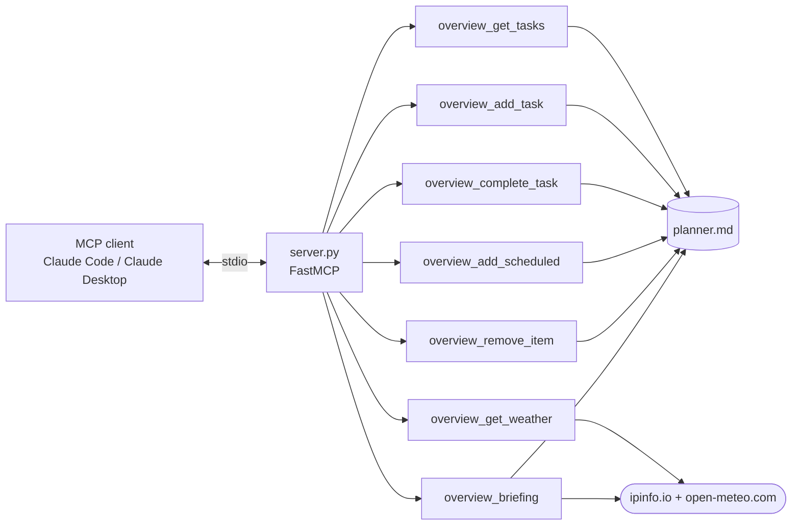

# daily-overview-mcp

[](https://github.com/darkspaz-v1/daily-overview-mcp/actions/workflows/ci.yml)

MCP server over a markdown planner and a live weather lookup — tasks, scheduled events, and a combined
daily briefing.

## Install

Requires Python 3.11 or newer (verified on 3.13).

```
git clone https://github.com/darkspaz-v1/daily-overview-mcp.git
cd daily-overview-mcp
python -m venv .venv
.venv\Scripts\activate
pip install -r requirements.txt
python test_server.py
```

`pip install .` also works and installs the same two dependencies (`mcp`, `pydantic`). The server is
started by your MCP client, not by hand; see [Register it](#register-it) below.

For linting (`ruff check .`, as CI does), use `pip install -r requirements-dev.txt` instead.

## Configuration

| Environment variable | Meaning | Default |
|---|---|---|
| `DAILY_OVERVIEW_PLANNER` | Path to your `planner.md` (sections `## Recurring`, `## Scheduled`, `## Tasks`). | `~/Desktop/Claude/daily-overview/planner.md` |

Set the variable in your MCP client config (below); the default is only a convenience fallback.

## Tools

| Tool | Does |
|---|---|
| `overview_get_tasks` | Read open tasks from `planner.md` |
| `overview_add_task` | Append a task |
| `overview_complete_task` | Mark one done |
| `overview_add_scheduled` | Add a dated/timed item |
| `overview_remove_item` | Remove a task or scheduled item |
| `overview_get_weather` | IP-geolocated forecast, `days` configurable |
| `overview_briefing` | Weather plus the day's tasks in one call |

## Architecture



## The design decision worth stating

The source of truth is a **plain markdown file a human edits by hand**, not a database. That means the
server has to tolerate a file that changed underneath it and formatting that a person wrote, which is
the real constraint — it parses and rewrites in place rather than owning the format.

`overview_briefing` exists because the common request ("what does my day look like?") otherwise costs
two round trips and a client-side join.

## Notes

- Tests run against a **temporary planner file**, so they never touch a real `planner.md`.
- The weather tools need network. If the lookup fails, the test asserts the **error path** behaved
  correctly instead of failing the run — a test suite that only passes online is not a test suite.

**35 checks pass.**

## About MCP

[Model Context Protocol](https://modelcontextprotocol.io) is a standard for exposing tools to an LLM
client. This server speaks MCP over stdio, so it is registered in the client config rather than run
directly.

### Register it

Claude Desktop reads `%APPDATA%\Claude\claude_desktop_config.json`:

```json
{
  "mcpServers": {
    "daily-overview": {
      "command": "python",
      "args": ["C:/path/to/daily-overview-mcp/server.py"],
      "env": { "DAILY_OVERVIEW_PLANNER": "C:/path/to/planner.md" }
    }
  }
}
```

Claude Code equivalent:

```
claude mcp add daily-overview -e DAILY_OVERVIEW_PLANNER=C:/path/to/planner.md -- python C:/path/to/daily-overview-mcp/server.py
```

Use the Python from the environment where you ran `pip install -r requirements.txt` (for a venv, the full
path to `.venv\Scripts\python.exe`) as `command`.

**Register it twice if you use both Claude Code and Claude Desktop.** They read separate config files,
and a server registered in one is invisible to the other — this cost real debugging time.

## Tests

```
python test_server.py
```

Drives every tool through the real handlers and prints one `PASS` line per check. No pytest — the
suite is a single script so it runs anywhere with no dev dependencies.

## License

MIT — see [LICENSE](LICENSE).
